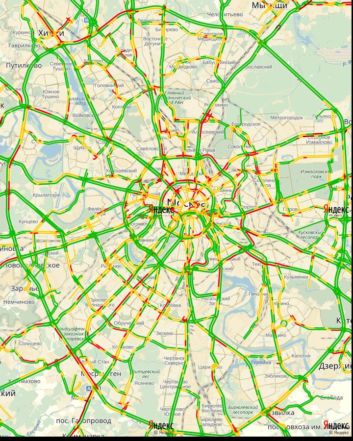
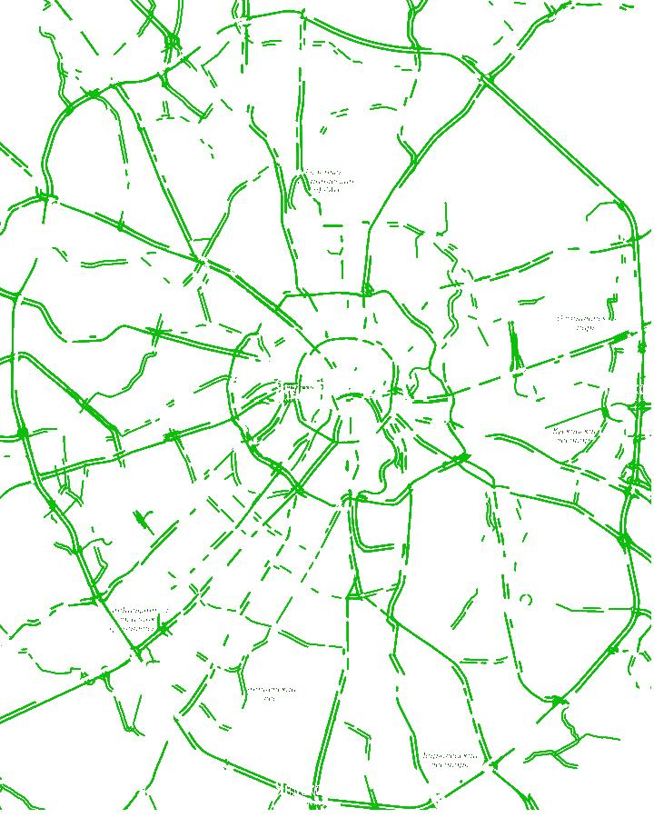
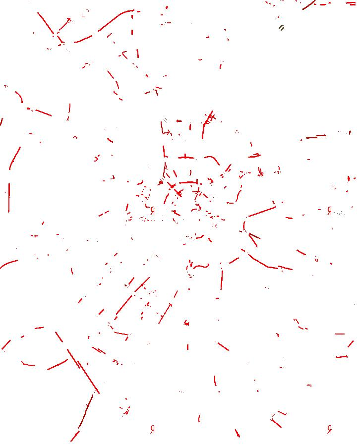
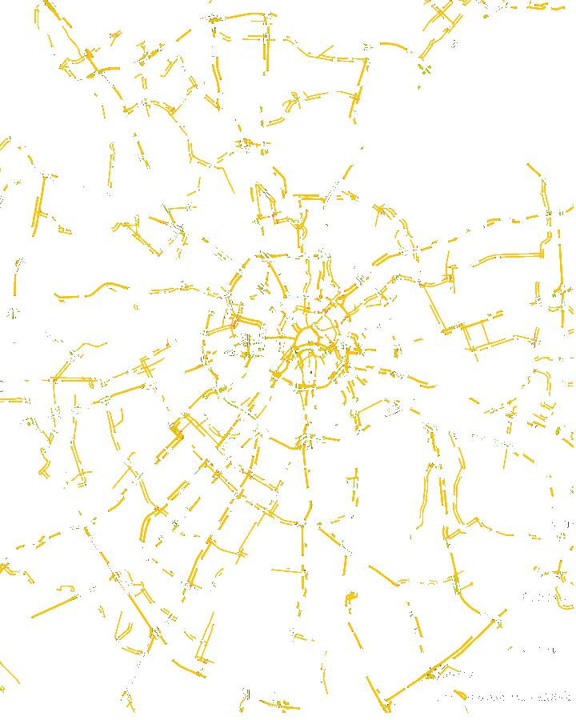

# Maps

## Введение

Рассмотренна задача анализа загруженности дорог в течении дня по изображениям. Необходимо распознать процентное соотношение дорог с свободным потоком (зеленый цвет), загруженным (желтый) и «пробки» (красный).

## Решение

Разбив исходное изображение на цветовые каналы и проделав с каждым пороговое преобразование по цвету, затем применив к полученным результирующим матрицам логическую операцию «И» (&), результатом получим бинарное изображение, у которого белыми пикселами будут выделены исходные пиксели прошедшие пороговую бинаризацию.  
Дополнив матрицу отсутствующими цветовыми каналами из исходного изображения (рисунок 3.5) получим результирующее изображение, содержащее в себе только те цветные пиксели, которые прошли пороговое преобразование.
Создав 3 фильтра (зеленый (рисунок 3.6), желтый (рисунок 3.8), красный (рисунок 3.7)) мы можем рассчитать процентное соотношение количества пикселей, прошедших преобразование (рисунок 3.9).

  
Рисунок 3.5. – Исходное изображение
  
Рисунок 3.6. – Фильтр по зеленому каналу
  
Рисунок 3.7. – Фильтр по красному каналу
  
Рисунок 3.8. – Фильтр по зеленому и синему каналу

## Исходные данные
Исходные данные находятся в папке [Map](map/).

## Результаты
Результаты сохраняются в папку [Results Map](Results_Map/).
